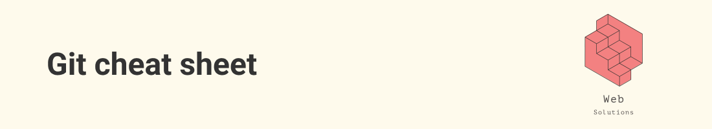

## Podstawowe komendy

```sh
git clone [http address] [opcjonalnie nazwa katalogu]   -> pobiera projekt z repozytorium

git pull                        ->  pobieranie zmian z repozytorium
git status                      ->  status zmian
git add .                       ->  dodanie wszystkich zmian do kolejki
git commit -m "komentarz"       ->  zatwierdzenie zmian
git push -u origin main         ->  wgranie zmian do zdalnego repozytorium
```

## Gałęzie "Branch"

```sh
git branch [name]               -> towrzy nowy branch
git checkout [name]             -> przechodzi na nowy branch
git merge [other branch]        -> łączy obecny branch z innym
git branch -d [name]            -> usuwa branch
git branch                      -> wyświetla branch'e
```

## Rozszerzenie

```sh
git pull origin main            ->  pobieranie zmian z konkretnego brancha

git add [nazwa pliku]           ->  dodanie wybranych plików
git reset                       ->  zresetowanie kolejki
git stash                       ->  usunięcie zmian

git commit -am "komentarz"      ->  jednoczesne dodanie i zatwierdzenie zmian

git reset --soft HEAD~1         ->  cofnęcie commita
git push origin +main           -> kiedy usuniemy commity, to robimy force push
```

## Konfiguracja git'a

```sh
git config core.editor      ->  znień domyślny edytor na nano
```

> aby wyjść z VIM'a klikamy esc :w , :q

## Konsola

```sh
cd          ->  wejdź do folderu
cd ..       ->  wyjdź z folderu
```

<br/>
<i><h6 align="center">&copy; Created by Aleksander Atamańczuk</h6></i>
